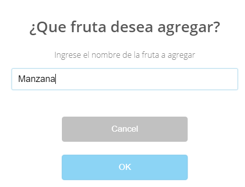

# Lista de frutas!
 
## Proceso

 **1. HTML**
	
	* Título: "Lista de Fruta!"  El cual se realizo con un tamaño h1
	* Subtítulo: "Frutas Master"  con tamaño h4
	* Presentación: "Frutas Master es una empresa familiar de tercera generacion ..." 
	  Se refiere a la presentación de la empresa, se realizo con un tipo de texto párrafo p
	* Se inserto una imagen con formato gif
	* Se agrego un botón para la captura de datos de la lista de frutas
	* Subtítulo: "Lista de frutas: Catálogo" con tamaño h3
	* Espacio div: Para la proyección de los resultados de la lista de frutas
	* Extra: A lo anterior fue agregado la librería de sweetalert para los cambios en los tipos de alerta
	  para la captura de datos de la lista de frutas

**2. CSS**
	
	* Se copio CSS previamente realizado para proyecto de compra.
	* Fuentes: tipo de letra usada "sans-serif"
	* Body Background: color de fondo "Cornsilk"
	* Body Color: color de letra "Grey"
	* Buttom: Descripción de tamaño, color de fondo del botón, color de letra y bordes.

**3. JAVASCRIPT**
	
	* Bajo el modelo anteriormente creado para el proyecto de compra.
	* Se agrego un prompt bajo diseño de sweetalert el cual permite el ingreso de datos de frutas de forma más llamativa.
	* Se inicia declarando una lista en el cual se guardaron los datos referentes a las frutas.
	* Se usaron funciones para la captura de datos e impresión de los mismos.

## Resultado
	Portada de entrada

	Boton Añadir nueva fruta

	Frutas agregadas en lista
